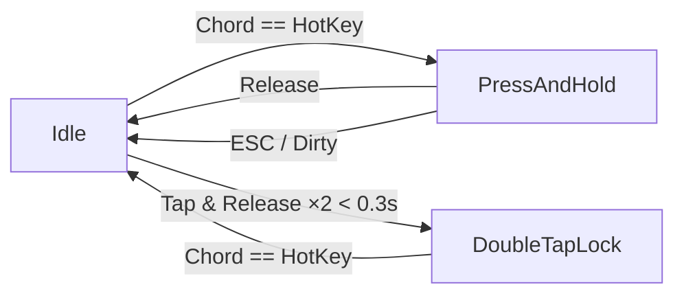

## HotKey 设计文档

### 1. 设计目标

HotKey 系统负责监听全局键盘事件并根据用户在设置中配置的快捷键来驱动录音、转录等核心功能。设计时需要兼顾：

1. **便捷性**：支持单键、组合键以及纯修饰键（Modifier-Only）三种触发方式。
2. **可靠性**：在 macOS 全局范围内捕获事件，同时避免与系统/其他程序冲突。
3. **灵活性**：同时支持「长按触发」(Press-and-Hold) 与「双击锁定」(Double-Tap Lock) 两种交互模式，并允许用户在设置里随时切换。
4. **可扩展**：所有热键相关逻辑都集中在独立模块，方便未来加入新的触发手势（例如长按两秒锁定、三击等）。

---

### 2. 数据模型

#### 2.1 `Modifier`
```swift
public enum Modifier: Identifiable, Codable, Equatable, Hashable, Comparable {
    case command, option, shift, control, fn
    ...
    var stringValue: String // "⌘", "⌥" …
}
```
- 使用 `enum` 表达五种 macOS 常见修饰键。
- 提供 `stringValue` 方便 UI 直接渲染，无需硬编码符号。

#### 2.2 `Modifiers`
```swift
public struct Modifiers {
    var modifiers: Set<Modifier>
    var isHyperkey: Bool // ⌘⌥⇧⌃ 四键全按时返回 true
    var sorted: [Modifier] // 根据 Comparable 自动排序 便于 UI 稳定
    ...
    static func from(cocoa: NSEvent.ModifierFlags) -> Self
    static func from(carbonFlags: CGEventFlags) -> Self
}
```
- 使用 `Set` 表示无序组合，再由 `sorted` 转为确定顺序以保证渲染一致。
- `isHyperkey` 特殊处理四键全按场景，在 UI 里显示 ✦。
- 提供 **双向桥接** 方法：
  - Cocoa 层 (`NSEvent`)
  - Carbon 层 (`CGEvent`)

#### 2.3 `HotKey`
```swift
public struct HotKey: Codable, Equatable {
    var key: Key?        // Sauce.Key，nil 表示纯修饰键
    var modifiers: Modifiers
}
```
- `key` 为空代表 Modifier-Only 热键（例如只按住 ⌥）。
- 通过 `Codable` 可以直接持久化到 `HexSettings`。

---

### 3. 事件监听层 – `KeyEventMonitorClient`

文件：`Hex/Clients/KeyEventMonitorClient.swift`

1. **CGEvent Tap** — 在 `cghidEventTap` 层捕获 `keyDown` / `keyUp` / `flagsChanged`，理论上优先级高于一般 App，使得即便窗口不在前台也可监听。
2. 输出统一事件 `KeyEvent { key: Key?, modifiers: Modifiers }`，与业务层完全解耦。
3. `SafeSauce` 包装：
   - Sauce 库要求在主线程调用，否则抛 `_dispatch_assert_queue_fail`。
   - 通过 `DispatchQueue.main.sync` 保证线程安全。
4. 通过 `Dependency` 暴露以下能力：
   - `listenForKeyPress()`：返回 `AsyncThrowingStream<KeyEvent, Error>`；适合 **异步序列** 订阅。
   - `handleKeyEvent(_:)`：回调式，若返回 `true` 则拦截事件不再向系统分发。

---

### 4. 状态机层 – `HotKeyProcessor`

文件：`Hex/Features/Transcription/HotKeyProcessor.swift`



核心常量：
- `doubleTapThreshold = 0.3s`：两次「轻触」间隔小于该值判定为双击。
- `pressAndHoldCancelThreshold = 1.0s`：长按后一秒内若组合键变化视为取消。

状态定义：
1. **idle** — 等待匹配。
2. **pressAndHold(startTime)** — 已触发录音，松开即停止。
3. **doubleTapLock** — 双击后锁定录音，再次按下同一热键或完全释放才停止。

输出事件：
- `.startRecording`/`.stopRecording`/`.cancel`

> Press-and-Hold 与 Double-Tap 模式共用一套状态机，逻辑集中维护，便于后续扩展。

---

### 5. 业务集成 – `TranscriptionFeature`

1. 通过 `startHotKeyMonitoringEffect()` 将 `KeyEventMonitorClient` 与 `HotKeyProcessor` 串联。
2. 根据 `HotKeyProcessor.Output` 触发：
   - `.startRecording` → 调用 `RecordingClient` 开始录音。
   - `.stopRecording` → 完成录音并进入转录流程。
   - `.cancel` → 丢弃当前录音。
3. Watchdog 机制 (`hotKeyWatchdog`) 定时检查长按模式下热键是否仍被按住，防止录音卡死。

---

### 6. UI 展示层 – `HotKeyView`

- 使用 `KeyView` 组件将单个按键渲染成 48×48 圆角方块。
- `Modifiers.isHyperkey` 为 `true` 时显示 ✦（Black Four-Pointed Star）。
- 通过 `.blurReplace` + `.bouncy` 动画让热键录制/编辑时的视觉更流畅。

---

### 7. 设置存储 – `HexSettings`

```swift
var hotkey: HotKey = .init(key: nil, modifiers: [.option])
var useDoubleTapOnly: Bool = false
```
- 用户偏好通过 `JSONEncoder`/`Decoder` 持久化到磁盘 (`~/Library/Application Support/...`).
- 在「设置 → 快捷键」页面用户可以：
  1. 录制新的键位；
  2. 勾选「仅使用双击锁定」。

---

### 8. 扩展点

1. **多热键支持**：将 `HotKey` 数组加入 `HexSettings`，再在 `KeyEventMonitorClient` 中遍历匹配。
2. **手势/鼠标快捷键**：同样通过在 `KeyEvent` 扩展字段即可。
3. **自定义阈值**：暴露 `doubleTapThreshold` & `pressAndHoldCancelThreshold` 到高级设置。

---

### 9. 依赖关系总览

```text
+--------------------+       +-----------------+
| CGEvent Tap (HID)  |  ---> | KeyEventMonitor |
+--------------------+       +-----------------+
                                      |
                                      v
                               +--------------+
                               | HotKeyProcessor |
                               +--------------+
                                      |
                                      v
                          +--------------------+
                          | TranscriptionFeature |
                          +--------------------+
                                      |
                                      v
                       RecordingClient / other side effects
```

---

### 10. 小结

HotKey 系统以 **"监听 → 状态机 → 业务"** 的层次化设计实现了解耦与可测性：
- **单元测试** 可直接对 `HotKeyProcessor` 输入合成 `KeyEvent` 来验证状态转移。
- **集成测试** 通过 `KeyEventMonitorClient` 的 `live` 与 `unimplemented` 版本切换，保障 UI 流程不依赖真实键盘输入。

这样既保证了复杂交互的正确性，也让未来的功能扩展和跨平台移植更加轻松。 