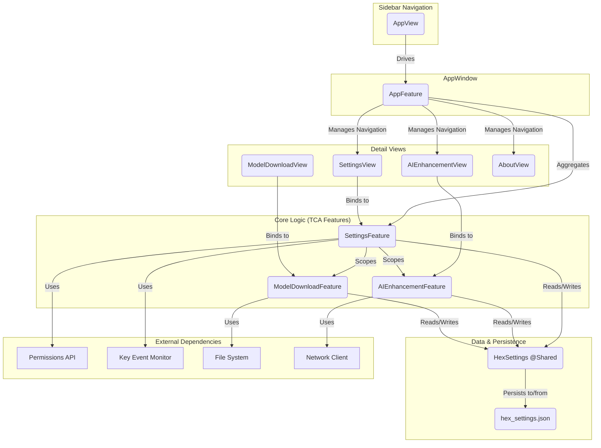

## TOK 设置功能技术文档

### 1. 概述

TOK 的设置功能采用 **The Composable Architecture (TCA)** 作为核心框架，构建了一个高度模块化、可测试且易于扩展的系统。所有用户配置项都集中管理，并通过 SwiftUI 构建响应式用户界面。

**核心设计理念**:
- **单一数据源**: 所有配置由 `HexSettings` 结构体统一管理，并通过 `@Shared` 在整个应用中共享，保证数据一致性。
- **模块化**: 功能被拆分为独立的 Feature，如主设置 (`SettingsFeature`)、AI 增强 (`AIEnhancementFeature`)、模型管理 (`ModelDownloadFeature`) 等，每个 Feature 都有自己的 State、Action 和 Reducer。
- **响应式 UI**: SwiftUI 视图直接订阅 TCA `Store` 的状态变化，当状态更新时，UI 会自动刷新，无需手动干预。
- **依赖注入**: 使用 TCA 的 `@Dependency` 属性包装器来注入外部依赖（如文件系统、网络请求、权限检查等），方便在测试中替换为 Mock 对象。

---

### 2. 核心数据流与状态管理

#### 2.1 `HexSettings`: 配置的唯一数据源 (Single Source of Truth)

- **文件路径**: `Hex/Models/HexSettings.swift`

`HexSettings` 是一个遵循 `Codable` 和 `Equatable` 的 `struct`，它定义了应用中所有可配置的选项。

```swift
struct HexSettings: Codable, Equatable {
    // General Settings
    var hotkey: HotKey = .init(key: nil, modifiers: [.option])
    var openOnLogin: Bool = false
    var showDockIcon: Bool = true
    
    // Transcription Settings
    var selectedTranscriptionModel: TranscriptionModelType = .whisperLarge
    var openaiAPIKey: String = ""
    
    // AI Enhancement Settings
    var useAIEnhancement: Bool = false
    var aiProviderType: AIProviderType = .ollama
    // ... 其他几十个设置项
}
```

**持久化与共享**:
1.  **JSON 持久化**: 通过遵循 `Codable`，`HexSettings` 实例可以被 `JSONEncoder` 编码并保存到磁盘中。持久化路径位于 `URL.documentsDirectory.appending(component: "hex_settings.json")`。
2.  **向后兼容**: `init(from decoder: Decoder)` 自定义解码器通过 `decodeIfPresent` 为新增字段提供默认值，确保老版本用户升级 App 后不会因缺少配置项而导致解析失败或崩溃。
3.  **全局共享**: TCA 的 `@Shared` 属性包装器被用来创建一个全局可访问的 `hexSettings` 实例。任何 Feature 只要声明 `@Shared(.hexSettings) var hexSettings: HexSettings`，就可以读取和修改这份全局配置。当值改变时，所有订阅该状态的 UI 都会自动更新。

#### 2.2 `AppFeature`: 顶级聚合 Reducer

- **文件路径**: `Hex/Features/App/AppFeature.swift`

`AppFeature` 作为整个设置窗口的根 Feature，它不处理具体业务逻辑，而是扮演一个"路由器"和"聚合器"的角色。

- **状态聚合**: `AppFeature.State` 持有所有子 Feature 的 State，例如 `var settings: SettingsFeature.State`。
- **动作分发**: `AppFeature.Action` 将来自子 Feature 的动作（如 `.settings(SettingsFeature.Action)`) 分发给对应的子 Reducer 处理。
- **导航管理**: 它定义了一个 `ActiveTab` 枚举，并通过 `NavigationSplitView` 控制左侧导航栏和右侧详情页的显示内容。

---

### 3. UI 架构

设置界面的 UI 完全由 SwiftUI 构建，并遵循 TCA 的视图驱动模式。

#### 3.1 `AppView` 和 `NavigationSplitView`

- **文件路径**: `Hex/Features/App/AppFeature.swift`

`AppView` 是设置窗口的根视图，它包含一个 `NavigationSplitView`：
- **侧边栏 (Sidebar)**: 一个 `List`，根据 `AppFeature.ActiveTab` 来高亮当前选中的导航项。点击按钮会发送 `.setActiveTab` 动作来改变 `activeTab` 状态。
- **详情区 (Detail)**: 一个 `switch` 语句，根据 `store.state.activeTab` 的值来决定渲染哪个子视图，例如 `SettingsView` 或 `AIEnhancementView`。

```swift
// AppView.swift (简化版)
NavigationSplitView {
    List(selection: $store.activeTab) { /* ... 导航按钮 ... */ }
} detail: {
    switch store.state.activeTab {
    case .settings:
        SettingsView(store: store.scope(state: \.settings, ...))
    case .aiEnhancement:
        AIEnhancementView(store: store.scope(state: \.settings.aiEnhancement, ...))
    // ... 其他 case
    }
}
```

#### 3.2 `SettingsView` 等子视图

- **文件路径**: `Hex/Features/Settings/SettingsView.swift` 等

每个详情视图都遵循相似的模式：
- 使用 `Form` 和 `Section` 来构建典型的 macOS 设置界面外观。
- UI 控件（如 `Toggle`, `Picker`, `Slider`）直接通过 `$` 绑定到 `store` 中的状态。例如 `Toggle("Sound Effects", isOn: $store.hexSettings.soundEffectsEnabled)`。
- 对于需要执行副作用的交互（如点击按钮），则通过 `store.send(...)` 发送一个 Action。

---

### 4. 模块化设计详解

设置功能被精心拆分成多个独立的 Feature，每个 Feature 都可以独立开发、测试和预览。

#### 4.1 `SettingsFeature` (主设置)

这是最核心的设置模块，负责通用配置和权限管理。

- **权限管理**:
  - **状态**: `microphonePermission: PermissionStatus`, `accessibilityPermission: PermissionStatus`。
  - **逻辑**: 在 `.task` 中通过 `checkPermissions` 动作初始化权限状态。UI 根据状态显示不同按钮（"请求权限"或"已授权"）。点击按钮后发送 `requestMicrophonePermission` 等动作，这些动作的 Reducer 会调用系统 API (`AVCaptureDevice.requestAccess`, `AXIsProcessTrustedWithOptions`)，然后将结果通过新的 Action (`setMicrophonePermission`) 发回以更新状态。
- **热键录制**:
  - 通过一个内存中的共享状态 `@Shared(.isSettingHotKey)` 来控制是否进入录制模式。
  - 点击热键视图后，发送 `startSettingHotKey` 将该标志位设为 `true`。
  - 此后，`keyEventMonitor` 捕获的键盘事件会触发 `keyEvent` Action，Reducer 会更新 `hexSettings.hotkey` 并将 `isSettingHotKey` 设回 `false` 来结束录制。
- **子 Feature 嵌入**:
  - `SettingsFeature` 内部通过 `Scope` 将 `ModelDownloadFeature` 和 `AIEnhancementFeature` 嵌入。这意味着 `SettingsFeature` 是这两个子 Feature 的父级。

#### 4.2 `ModelDownloadFeature` (模型管理)

- **文件路径**: `Hex/Features/Settings/ModelDownloadFeature.swift`

负责本地转录模型的下载、删除和状态管理。

- **数据来源**: 从项目内嵌的 `models.json` 文件加载策划好的模型列表 (`CuratedModelInfo`)。
- **状态同步**: 通过 `transcription.isModelDownloaded(name)` 检查模型文件是否已存在于本地，并更新 `isDownloaded` 状态。
- **副作用处理**: 点击"下载"按钮会触发 `downloadSelectedModel` Action，其 Reducer 会调用 `transcription.downloadModel` 这个异步方法。下载过程中，进度更新会通过 `downloadProgress` Action 持续发回，更新 UI 上的进度条。下载完成后，`downloadCompleted` Action 会被发送。

#### 4.3 `AIEnhancementFeature` (AI 增强)

- **文件路径**: `Hex/Features/Settings/AIEnhancementFeature.swift`

管理所有与 AI 后处理相关的配置。

- **动态 UI**: 视图会根据 `currentProvider`（如 `.ollama` 或 `.groq`）动态显示或隐藏 API Key 输入框和连接测试按钮。
- **连接检查**:
  - 对于 Ollama，它会定期检查本地服务是否可用 (`aiEnhancement.isOllamaAvailable`)。
  - 对于 Groq，用户可以点击"Test Connection"按钮，触发 `testConnection` Action 来验证 API Key 的有效性。

#### 4.4 `AboutView` (关于)

- **文件路径**: `Hex/Features/Settings/AboutView.swift`

一个相对简单的视图，但包含两个值得注意的实现：
1.  **自动更新**: 集成了 `Sparkle` 框架。`CheckForUpdatesViewModel` 包装了 `SPUStandardUpdaterController`，实现了检查更新的逻辑。
2.  **隐藏开发者模式**: 通过连续点击版本号文本 8 次，会触发 `store.send(.binding(.set(\.hexSettings.developerModeEnabled, true)))`，从而启用开发者模式，并在主导航中显示"Developer"选项卡。

---

### 5. 依赖关系与架构图



### 6. 总结

TOK 的设置功能是 TCA 架构的最佳实践范例。通过将复杂功能拆解为独立的、可组合的模块，并利用共享状态和依赖注入，项目实现了高度的内聚和低耦合。这不仅使得代码库易于理解和维护，还极大地简化了单元测试和 UI 测试的编写。开发者可以轻松地在任何一个层次上进行修改或扩展，而不用担心会引发不可预见的副作用。 