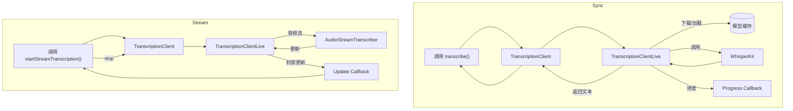

# TranscriptionClient.swift 设计实现详解

> 本文档基于 `Hex/Clients/TranscriptionClient.swift` 源码撰写，旨在帮助开发者快速理解其架构与实现细节。

---

## 1. 文件定位与职责
`TranscriptionClient.swift` 位于 `Hex/Clients` 目录，扮演 **音频转录领域 Facade** 的角色，实现以下功能：

1. **多后端统一封装**：WhisperKit（本地 CoreML 模型）与 OpenAI API。  
2. **模型生命周期管理**：下载 → 加载 → 预热 → 卸载。  
3. **两类转录服务**：离线文件转录 & 实时流式转录。  
4. **依赖注入**：通过 `@DependencyClient` / `DependencyKey` 暴露给全局。  
5. **进度与流式更新**：面向 UI 的语义化回调。  

---

## 2. 关键数据结构
| 类型 | 说明 |
| ---- | ---- |
| `StreamTranscriptionUpdate` | 流式更新 DTO，含 `confirmedSegments`、`unconfirmedSegments`、`currentText`、`isComplete` |
| `TranscriptionSegment` | 单段文本 + 时间戳 (start/end) |
| `TranscriptionClient` | Facade，暴露全部 API （下载、转录、流式、清理、测试 API Key 等） |
| `TranscriptionClientLive` | `actor`，真正执行业务逻辑，管理 WhisperKit、AudioStreamTranscriber 等 |

---

## 3. 核心流程
### 3.1 模型下载 & 加载
- `downloadAndLoadModel()`：
  - **0–50%**：`WhisperKit.download()` 拉取 Hugging Face 仓库模型。
  - **50–100%**：`loadWhisperKitModel()` 预热并加载至内存。
- 具备完整性检查、删除、离线 fallback、防脏文件等增强逻辑。

### 3.2 离线文件转录
1. `transcribe()` 首先将字符串 `model` 解析为 `TranscriptionModelType`，区分本地 / OpenAI。  
2. WhisperKit 分支如需换模型则 `unloadCurrentModel()` → `downloadAndLoadModel()`。  
3. 返回文本前根据用户设置决定是否关闭自动首字母大写。  

### 3.3 实时流式转录
1. `startStreamTranscription()`：
   - 先 `stopStreamTranscription()` 停止旧流。  
   - 确保模型已就绪；若需切换重新加载。  
2. 构造 `AudioStreamTranscriber`，注入 WhisperKit 的 encoder / decoder / tokenizer 等组件。  
3. 回调闭包内：
   - `cleanWhisperTokens()` 清理 `<|xxx|>`、时间戳 token；
   - 封装为自定义 `StreamTranscriptionUpdate` 发送至上层。  
4. `stopStreamTranscription()` 处理 Task 取消、状态回收，避免竞态 & 崩溃。  

---

## 4. 并发与资源管理
- `TranscriptionClientLive` 使用 **Swift Concurrency actor**，天然保证线程安全。  
- 通过 `streamTask` + `isStreamingActive` 分离文件转录 & 流式转录资源。  
- 对取消 (`CancellationError`) 与普通错误做差异化处理。  

---

## 5. 磁盘目录规范
所有模型保存在：
```
~/Library/Application Support/com.kitlangton.Hex/models/argmaxinc/whisperkit-coreml/<variant>/
```
Tokenizer 位于 `<variant>/tokenizer/。下载完通过 `moveContents(of:to:)` 原子移动。

---

## 6. 进度与回调设计
- 使用 `Foundation.Progress`，`totalUnitCount = 100`，UI 可直接绑定 `fractionCompleted`。  
- 文件转录：监听 `progressCallback`。  
- 流式转录：监听 `StreamTranscriptionUpdate`，实时渲染文本。  

---

## 7. 错误处理
- 自定义 `TranscriptionError`（`apiKeyMissing` / `apiKeyInvalid`）区分 OpenAI 场景。  
- `do-catch` 分类打印：网络、取消、IO 等。  
- 不可恢复错误直接上抛，UI 弹窗；可恢复错误内部消化。  

---

## 8. 扩展点
1. Provider 抽象可快速接入 DeepGram、Azure Speech 等。  
2. 已支持 `prewarmModel()`，可在设置页预载常用模型，降低冷启动。  
3. `cleanWhisperTokens()` 公开为 `nonisolated`，可被其他模块重用。  

---

## 9. 实现片段引用
```swift
// downloadAndLoadModel – 整体进度 0–100%
func downloadAndLoadModel(variant: String, progressCallback: @escaping (Progress) -> Void) async throws
```

```swift
// transcribe – 按 Provider 动态分派
func transcribe(url: URL, model: String, options: DecodingOptions, ...) async throws -> String
```

```swift
// 开启流式转录
func startStreamTranscription(model: String, options: DecodingOptions, ...) async throws
```

---

## 10. 架构示意图


---

## 11. 最佳实践
- **单实例**：App 级别只应维持一个 `TranscriptionClientLive` 实例。  
- **操作顺序**：调用 `transcribe()` 前需确保没有流式任务；反之亦然。  
- **磁盘清理**：在设置页暴露删除模型功能，避免占用过多磁盘。  
- **日志分级**：生产环境使用 `OSLog`，并控制 `logLevel`。  

---

> **完** 